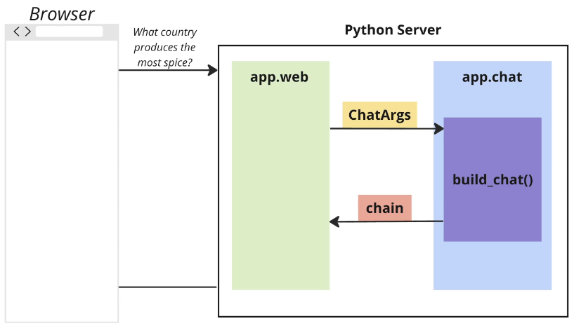
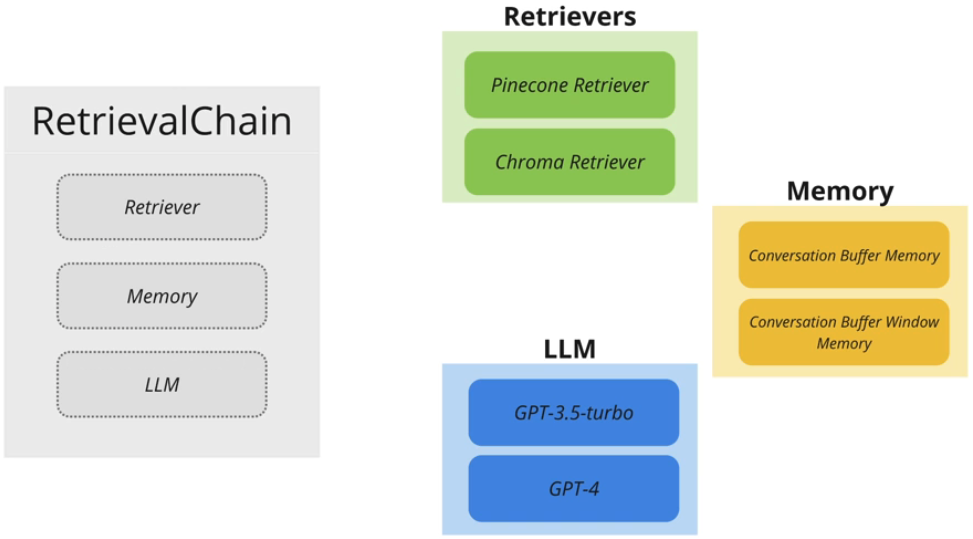

# PDFAnswerBot

## About:

- Description: AI-powered question answering for PDFs with user feedback.
- Tech stack:
  - LLM: ChatGPT, LangChain
  - Frontend: JavaScript, HTML, CSS
  - Backend:
    - Language & framework: Python, Flask
    - Asynchronous job queue: Celery (Python specific)
    - Message broker: Redis
    - Vector database: Pinecone
- Overview:

  - App workflow:
    
  - The Python server:
    
  - Converational QA chain:
    
  - Persistent message storage:
    
  - Conversational retrieval chain:
    
    
  - Streaming text generation:
    
    `streaming` controls how OpenAI responds to LangChain, and the way to call the model controls how OpenAI resonds to LangChain + how LangChain responds to the user:
    
  - Random component parts in retrieval chain:
    
  - The retrieval chain component maps:
    

## Setup:

1. (For project isolation) create & activate a virtual environment (dependencies are installed within the virtual environment other than system-wide & all subsequent steps will be performed within the virtual environment):
   ```
   python -m venv .venv
   source .venv/bin/activate
   ```
2. Upgrade the pip package manager to the latest version within the current Python environment: `python -m pip install --upgrade pip`
3. Install libraries/packages/dependencies: `pip install -r requirements.txt`
4. Initialize the database (if ever need to clear out all the data from this application, just run this command again): `flask --app app.web init-db`
<!-- Start the file upload server with `python app.py` -->
5. Install Redis on the macOS system using Homebrew: `brew install redis`

## Running the app

There are 3 separate processes that need to be running for the app to work:


- invoke the Python server (in development mode): `inv dev`
- launch the Redis server (the message broker), allowing it to accept connections and handle data storage and retrieval:

  ```
  # launch the Redis server:
  redis-server

  # (only if needed) identify the process using port 6379:
  lsof -i :6379

  # (only if needed) terminate a process:
  kill <PID>
  ```

- invoke the worker: `inv devworker`

If you stop any of these processes, you will need to start them back up!

If you need to stop them, select the terminal window the process is running in and press ctrl+C to quit.

To reset the database: `flask --app app.web init-db`

I've created an account using the email `user@test.com` and the password `abc123`.

## Resources:

1. [.gitignore File – How to Ignore Files and Folders in Git](https://www.freecodecamp.org/news/gitignore-file-how-to-ignore-files-and-folders-in-git/)
2. [Keyword Argument & Positional Argument in Python](https://www.geeksforgeeks.org/keyword-and-positional-argument-in-python/)
3. [python-dotenv: Load configuration without altering the environment](https://pypi.org/project/python-dotenv/)
4. [Pinecone Documentation](https://docs.pinecone.io/)
5. [Pinecone Examples](https://docs.pinecone.io/page/examples)
6. [Pinecone AI Support](https://support.pinecone.io/hc/en-us)
